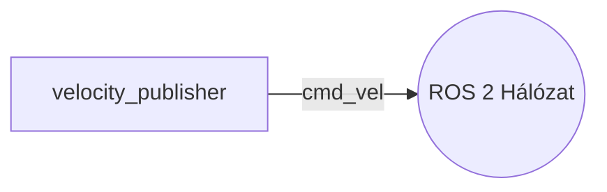

# mer_izr_kisbeadando

Ez a repository a ROS 2 kis beadandót tartalmazza. Egy autonóm robot mozgási parancsait (`geometry_msgs/Twist`) publikáló node található benne.

## Buildelés menete
```bash
cd ~/ros2_ws
colcon build --packages-select mer_izr_kisbeadando
source install/setup.bash
```
## Futtatás
```bash
ros2 run mer_izr_kisbeadando velocity_publisher
```
## Node-ok és Topic-ok kapcsolata

